# Bili Music

基于 Tauri v2 + Vue 3 构建的 B站音乐搜索与下载桌面应用。

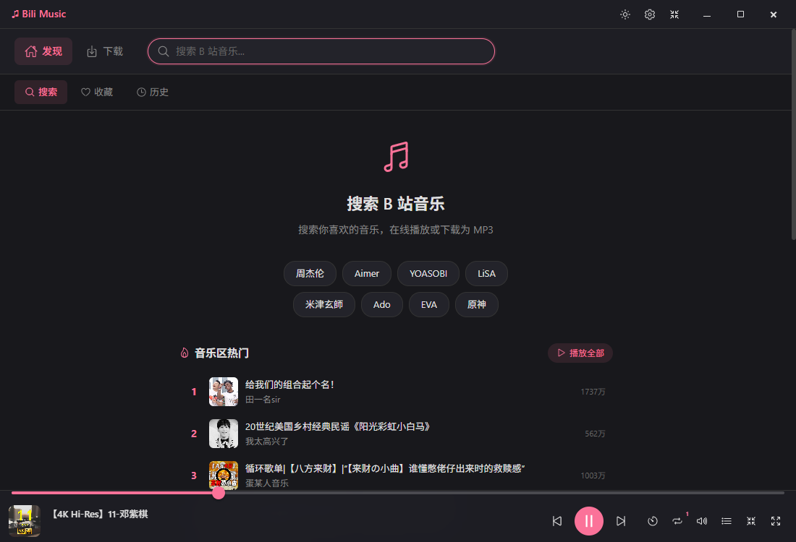

## 功能特性

- **音乐搜索** — 搜索 B站视频，一键播放音频
- **在线播放** — 流畅的在线播放体验，支持播放/暂停、上下曲、进度拖拽、音量调节
- **歌词显示** — 自动获取并同步滚动显示歌词，支持歌词偏移调节
- **音频下载** — 支持下载为 MP3/AAC/FLAC/WAV 格式，批量下载
- **播放列表** — 支持拖拽排序、一键清空
- **歌单管理** — 创建自定义歌单，导入 B站收藏夹
- **收藏功能** — 收藏喜欢的歌曲，智能歌单（最近播放、最常播放）
- **桌面歌词** — 独立的桌面歌词窗口，可调字体大小、透明度、位置
- **迷你播放器** — 紧凑的迷你播放窗口，不占用主界面空间
- **主题切换** — 明暗主题切换，支持自定义主题色
- **定时关闭** — 支持设置睡眠定时器
- **全局快捷键** — 系统级媒体控制，支持自定义快捷键

## 截图预览

### 搜索与播放

搜索 B站音乐，点击即可播放。

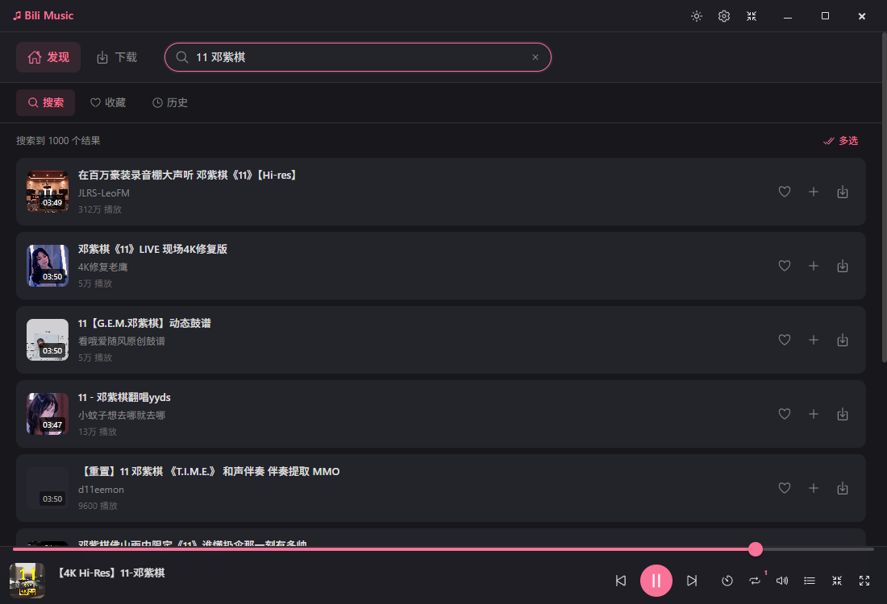

### 播放详情

沉浸式全屏播放，旋转唱片 + 同步歌词，右侧可展开播放列表面板。

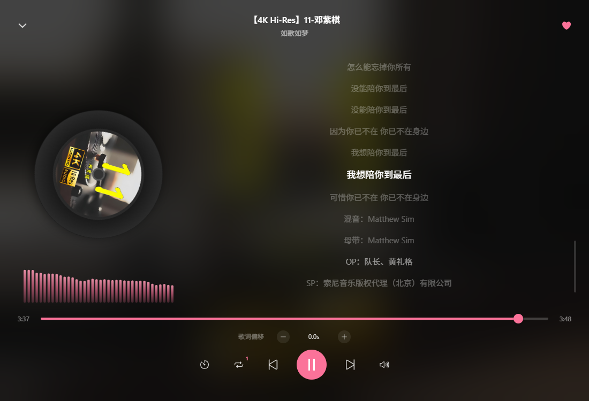

### 桌面歌词

独立桌面歌词窗口，始终置顶显示。


### 迷你播放器

紧凑的迷你播放窗口，可拖拽移动。


### 下载管理

支持 MP3/AAC/FLAC/WAV 多种格式，批量下载。

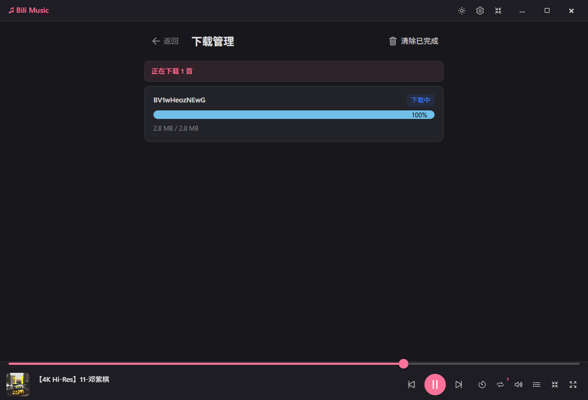

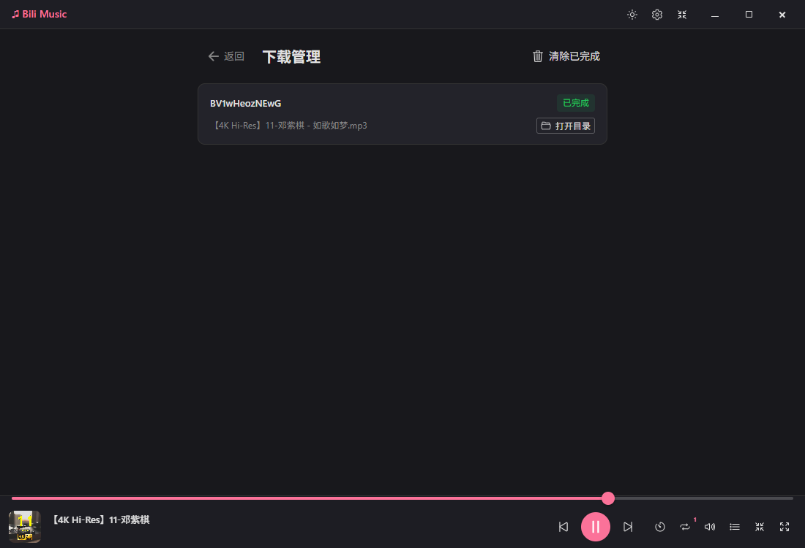

### 收藏与歌单

收藏喜欢的歌曲，创建自定义歌单，支持导入 B站收藏夹。

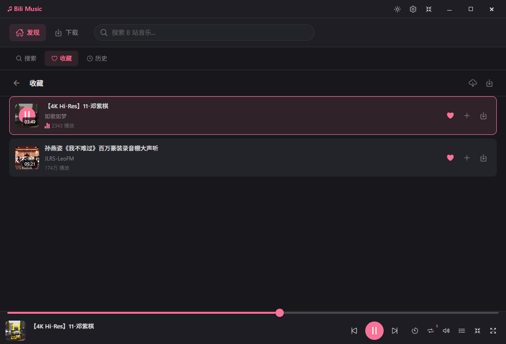

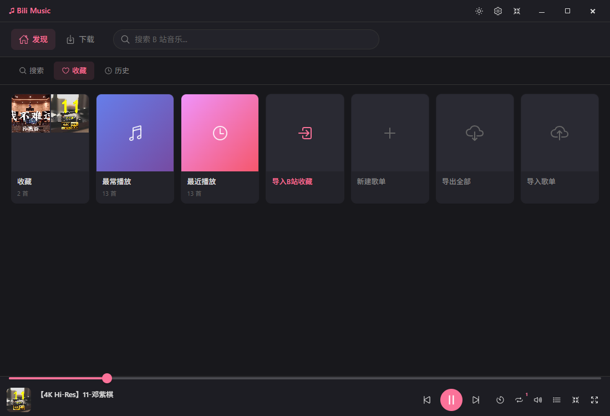

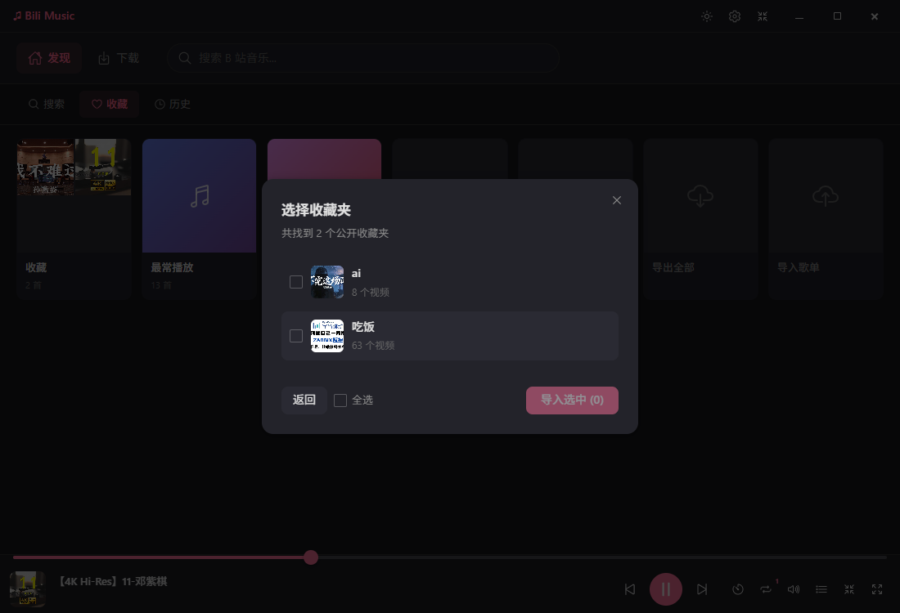

### 主题与设置

明暗主题切换，自定义主题色，全局快捷键等。

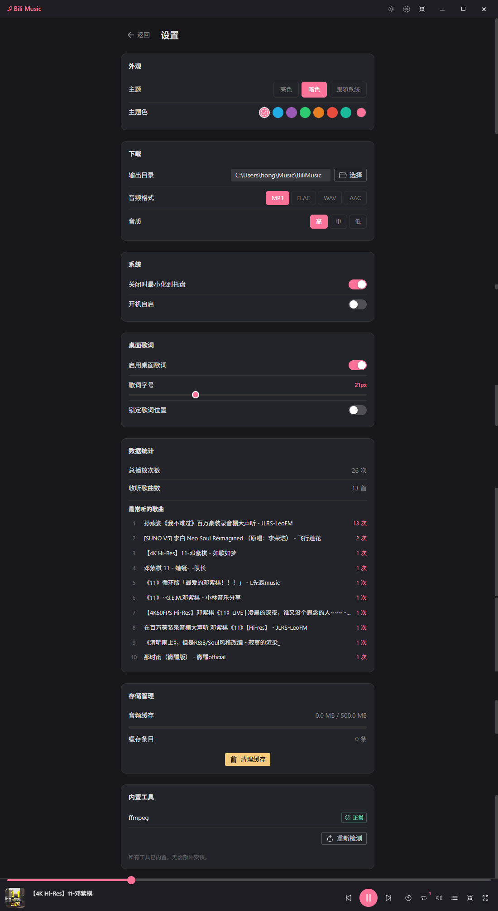

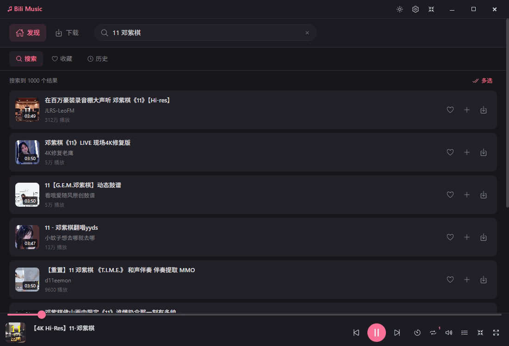

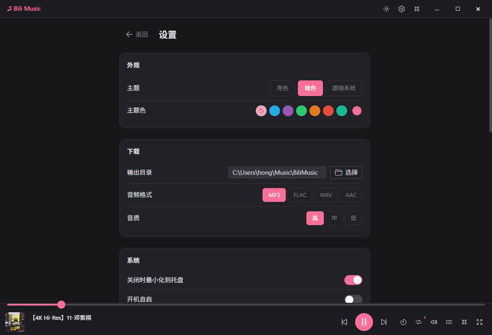

## 技术栈

| 层级 | 技术 |
|------|------|
| 前端 | Vue 3.5 (Composition API) / TypeScript / Vite 6 |
| UI 框架 | Naive UI / @vicons/ionicons5 |
| 状态管理 | Pinia + pinia-plugin-persistedstate |
| 路由 | Vue Router 4 (History 模式) |
| 后端 | Rust (Tauri 2) / tokio / reqwest / serde |
| 音频转换 | FFmpeg (MP3/AAC/FLAC/WAV) |
| 打包 | NSIS 安装包 (Windows) |

## 开发

```bash
# 安装依赖
pnpm install

# 启动开发模式
pnpm tauri dev

# 构建 .exe 安装包
pnpm tauri build
```

## 系统要求

- Windows 10 及以上
- WebView2 运行时（Windows 10/11 通常已内置）

## License

MIT
